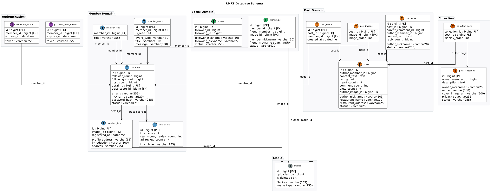

# RMRT (Real Money Real Taste)

> 진짜 내돈내산 푸디들의 소셜 플랫폼

[](https://sonarcloud.io/summary/new_code?id=AlbertImKr_RealMoneyRealTaste)
[](https://sonarcloud.io/summary/new_code?id=AlbertImKr_RealMoneyRealTaste)
[](https://sonarcloud.io/summary/new_code?id=AlbertImKr_RealMoneyRealTaste)
[](https://sonarcloud.io/summary/new_code?id=AlbertImKr_RealMoneyRealTaste)
[](https://sonarcloud.io/summary/new_code?id=AlbertImKr_RealMoneyRealTaste)

---

## 🌟 핵심 가치

**광고성 리뷰는 NO! 순수 내돈내산 리뷰만 YES!** 🙅‍♂️💰

- **Real Money First**: 내돈내산 리뷰 최우선
- **Transparent Disclosure**: 광고성/내돈내산 명확 구분
- **Trust-Based Ranking**: 신뢰도 기반 랭킹 시스템

## ✨ 주요 기능

### 🎯 내돈내산 리뷰 시스템

- 게시글 CRUD (생성, 조회, 수정, 삭제)
- 맛집 정보 및 평점 (1-5점)
- 이미지 업로드 (최대 5장, AWS S3 Presigned URL)
- 좋아요 및 조회수 관리
- 댓글 및 대댓글 (계층적 구조)

### 👥 소셜 네트워킹

- 친구 시스템 (요청, 수락, 거절, 해제)
- 팔로우/언팔로우 (단방향 관계)
- 컬렉션 (게시글 모음, 공개/비공개 설정)
- 프로필 페이지 (권한별 UI 분리)
- 추천 사용자 (무작위 선택 기반)
- **활동 기록 (MemberEvent)**: 회원의 모든 활동 자동 추적 및 알림

### 🏆 신뢰도 시스템

- 내돈내산 리뷰: +5점
- 광고성 리뷰: +1점
- 위반 페널티: -20점
- 신뢰도 레벨: BRONZE/SILVER/GOLD/PLATINUM (0-1000점)

### 🔐 회원 관리

- 이메일 기반 회원가입 및 인증
- 비밀번호 재설정 (이메일 토큰)
- 프로필 수정 (닉네임, 소개, 프로필 주소)
- 회원 상태 관리 (PENDING → ACTIVE → DEACTIVATED)

### 🎯 도메인 이벤트 시스템

- **AggregateRoot 패턴**: 모든 도메인 엔티티에서 이벤트 발행
- **이벤트 리스너**: 도메인 이벤트 기반 비동기 처리
    - MemberEvent 자동 생성 (친구 요청, 게시글 작성, 댓글 등)
    - 이메일 알림 발송 (회원가입 인증, 비밀번호 재설정)
- **이벤트 타입**: 친구/게시물/댓글/프로필/시스템 (총 10가지)
- **읽음 상태 관리**: 읽은/읽지 않은 이벤트 분리 조회

## 🛠 기술 스택

**Backend**

- `Kotlin 2.1.21` `Spring Boot 3.x` `Spring Security` `JPA` `QueryDSL`

**Database & Migration**

- `MySQL 8.0` `Flyway` (데이터베이스 버전 관리)

**Cloud & Infrastructure**

- `AWS S3` (이미지 스토리지, Presigned URL)
- `AWS ECS` (컨테이너 오케스트레이션)
- `AWS ECR` (컨테이너 레지스트리)
- `AWS RDS` (MySQL Multi-AZ)
- `AWS ALB` (Application Load Balancer)
- `AWS Route 53` (DNS 관리)

**DevOps & CI/CD**

- `Docker` (Multi-stage 빌드)
- `GitHub Actions` (완전 자동화 파이프라인)
- `SonarCloud` (코드 품질 분석, 커버리지 80%+)

**Testing**

- `JUnit5` `MockK` (단위 테스트)
- `Testcontainers` (통합 테스트, 실제 DB 환경)
- `LocalStack` (AWS S3 로컬 테스트)
- `k6` (성능 테스트 및 부하 테스트)

**Architecture**

- `Hexagonal Architecture` (Ports & Adapters)
- `DDD` (Domain-Driven Design)
- `Clean Architecture` (의존성 역전)
- `Event-Driven Architecture` (도메인 이벤트 기반 비동기 처리)

**Frontend**

- `HTMX` (동적 SPA-like 경험)
- `Thymeleaf` (서버 사이드 렌더링)
- `Bootstrap 5`

## 🌐 배포

- **프로덕션**: https://rmrt.albert-im.com/
- **인프라**: AWS 기반 컨테이너 오케스트레이션 (ECS, RDS, ALB)
- **CI/CD**: GitHub Actions 기반 자동화 파이프라인

### 📈 성과 지표

| 항목            | 성과                           |
|---------------|------------------------------|
| **배포 자동화**    | 배포 시간 83% 단축 (30분 → 5분)      |
| **코드 품질**     | SonarCloud 커버리지 80%+ 유지      |
| **테스트 코드**    | 약 15,000줄 (단위/통합/API 테스트)    |
| **아키텍처**      | 헥사고날 + DDD + Event-Driven 적용 |
| **이미지 시스템**   | S3 Presigned URL로 서버 부하 최소화  |
| **DB 마이그레이션** | Flyway 기반 자동 스키마 버전 관리       |
| **문서화**       | 2,800줄+ 기술 문서                |

### 🚀 성능 지표 (k6 부하 테스트 결과)

| 테스트 유형               | TPS   | p95 응답시간 | 에러율   | 달성률              |
|----------------------|-------|----------|-------|------------------|
| **READ**             | 29.0  | 27.0ms   | 0.00% | 290% (목표 10 TPS) |
| **WRITE**            | 42.3  | 90.3ms   | 0.00% | 846% (목표 5 TPS)  |
| **STRESS** (300 VUs) | 201.3 | 1099.5ms | 0.00% | 안정성 검증 완료        |

- **READ 처리량**: 목표 대비 **290%** 초과 달성
- **WRITE 처리량**: 목표 대비 **846%** 초과 달성
- **스트레스 테스트**: 300명 동시 접속 17분간 **에러 없이** 안정적 처리
- **총 처리량**: 252,176건 요청 처리 (34분간)

### ☁️ 클라우드 아키텍처

```
┌─────────────────┐    ┌────────────────────┐    ┌────────────────────┐
│   GitHub Actions│───▶│     AWS ECR        │───▶│   Amazon ECS       │
│ (CI/CD Pipeline)│    │(Container Registry)│    │ (Container Service)│
└─────────┬───────┘    └────────────────────┘    └────────┬───────────┘
          │                                               │
          │             ┌─────────────────┐               │
          │             │  Amazon Route 53│ ◀─────────────┘
          │             │ (DNS Management)│
          │             └────────┬────────┘
          │                      │
          ▼                      ▼
┌─────────────────┐     ┌─────────────────┐       ┌─────────────────┐
│    SonarCloud   │     │   Application   │       │   Amazon RDS    │
│  (Code Quality) │     │   Load Balancer │       │   (MySQL 8.0)   │
└─────────────────┘     │      (ALB)      │       │   (Multi-AZ)    │
                        └────────┬────────┘       └─────────────────┘
                                 │                         │
                                 ▼                         │
                        ┌─────────────────┐                │
                        │   ECS Cluster   │   ◀────────────┘
                        │  (rmrt-cluster) │
                        └────────┬────────┘
                                 │
                        ┌────────┴────────┐
                        │    ECS Task     │
                        │   (rmrt-task)   │
                        └─────────────────┘
                                 │
                        ┌────────┴────────┐
                        ▼                 ▼
                ┌─────────────┐   ┌─────────────────┐
                │  Amazon S3  │   │   CloudWatch    │
                │   (Image    │   │  (Monitoring)   │
                │   Storage)  │   └─────────────────┘
                └─────────────┘
```

### 📊 데이터베이스 구조



## 📚 문서

- [📋 도메인 요구사항](docs/DOMAIN_REQUIREMENTS.md)
- [🏗 도메인 모델](docs/DOMAIN_MODEL.md)
- [🏛 아키텍처](docs/ARCHITECTURE.md)
- [🚀 빠른 시작](docs/QUICK_START.md)
- [📖 API 문서](docs/API_DOCUMENTATION.md)
- [📷 이미지 관리 시스템](docs/IMAGE_MANAGEMENT.md)
- [🧪 테스트 가이드](docs/TESTING_GUIDE.md)
- [📊 성능 테스트 가이드](performance-tests/README.md)
- [✅ TODO 리스트](docs/TODO.md)

## 🚀 빠른 시작

```bash
git clone https://github.com/AlbertImKr/RealMoneyRealTaste.git
cd RealMoneyRealTaste
./gradlew bootRun
```

자세한 설치 및 실행 방법은 [빠른 시작 가이드](docs/QUICK_START.md)를 참고하세요.

## 📄 라이선스

MIT License
