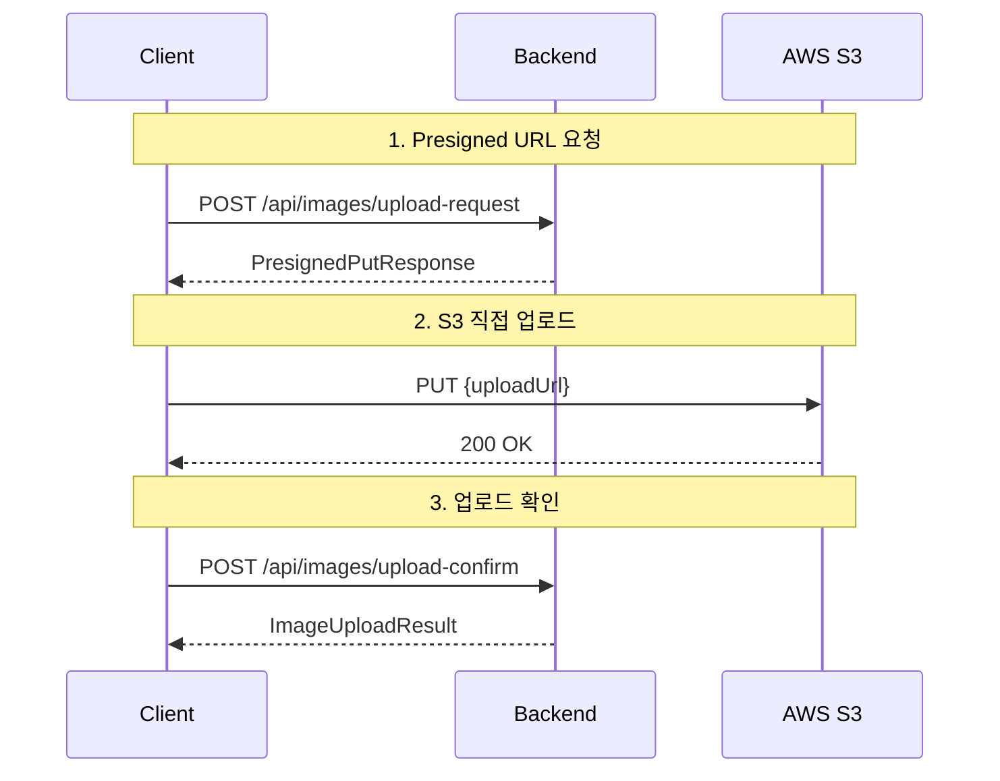

# 📖 API 문서

## 🌐 API 개요

RMRT는 RESTful API와 WebView 기반의 하이브리드 구조를 제공합니다.

- **Base URL**: `http://localhost:8080`
- **인증**: Spring Security 기반 Session 인증
- **Content-Type**: `application/json` (API) / `application/x-www-form-urlencoded` (Form)

## 📚 API 목차

### 👥 멤버 관련 API

- [멤버 프로필 조회](#멤버-프로필-조회)
- [추천 사용자 목록](#추천-사용자-목록)

### 🍽️ 포스트 관련 API

- [포스트 목록](#포스트-목록)
- [내 포스트 목록](#내-포스트-목록)
- [포스트 상세](#포스트-상세)
- [포스트 생성](#포스트-생성)
- [포스트 수정](#포스트-수정)

### 📷 이미지 관련 API (NEW!)

- [Presigned URL 요청](#presigned-url-요청)
- [업로드 확인](#업로드-확인)
- [업로드 상태 조회](#업로드-상태-조회)
- [이미지 URL 조회](#이미지-url-조회)
- [내 이미지 목록](#내-이미지-목록)
- [이미지 삭제](#이미지-삭제)

### 💬 댓글 관련 API

- [댓글 수 조회](#댓글-수-조회)
- [댓글 생성](#댓글-생성)
- [댓글 수정](#댓글-수정)

### 👥 친구 관련 API

- [친구 목록](#친구-목록)
- [친구 수 조회](#친구-수-조회)
- [친구 요청](#친구-요청)
- [친구 수락/거절](#친구-수락거절)
- [친구 삭제](#친구-삭제)

### ➿ 팔로우 관련 API

- [팔로우 통계 조회](#팔로우-통계-조회)
- [팔로잉 목록](#팔로잉-목록)
- [팔로워 목록](#팔로워-목록)
- [팔로우 생성](#팔로우-생성)
- [팔로우 삭제](#팔로우-삭제)

### 📚 컬렉션 관련 API

- [컬렉션 생성](#컬렉션-생성)
- [컬렉션 수정](#컬렉션-수정)
- [컬렉션 삭제](#컬렉션-삭제)
- [컬렉션 게시글 추가/제거](#컬렉션-게시글-추가제거)

---

## 👥 멤버 관련 API

### 멤버 프로필 조회

```http
GET /members/{id}/profile
```

**응답:** HTML 프로필 페이지

### 추천 사용자 목록

```http
GET /members/fragment/suggest-users-sidebar
```

**인증 필요**

**응답:** HTML 프래그먼트

---

## 🍽️ 포스트 관련 API

### 포스트 목록

```http
GET /posts/fragment
```

**쿼리 파라미터:**

- `page`: 페이지 번호 (기본값: 0)
- `size`: 페이지 크기 (기본값: 10)
- `sort`: 정렬 기준 (기본값: createdAt,desc)

**응답:** HTML 프래그먼트

### 내 포스트 목록

```http
GET /members/my/posts
GET /members/my/posts/fragment
```

**인증 필요**

**응답:** HTML 페이지/프래그먼트

### 포스트 상세

```http
GET /posts/{postId}
GET /posts/{postId}/modal
```

**응답:** HTML 상세 페이지/모달

### 포스트 생성

```http
POST /posts/create
Content-Type: application/x-www-form-urlencoded
```

**인증 필요**

**요청 파라미터:**

- `restaurantName`: 식당 이름
- `restaurantAddress`: 식당 주소
- `content`: 내용
- `isRealMoney`: 내돈내산 여부
- `rating`: 평점

### 포스트 수정

```http
POST /posts/{postId}/update
Content-Type: application/x-www-form-urlencoded
```

**인증 필요**

---

## 📷 이미지 관련 API

> **AWS S3 Presigned URL 방식**을 사용하여 서버 부하를 최소화하고 안전한 이미지 업로드를 제공합니다.

### 전체 업로드 플로우



### Presigned URL 요청

```http
POST /api/images/upload-request
Content-Type: application/json
```

**인증 필요**

**요청:**

```json
{
  "fileName": "photo.jpg",
  "contentType": "image/jpeg",
  "fileSize": 1024000,
  "imageType": "POST_IMAGE",
  "width": 1920,
  "height": 1080
}
```

**요청 필드:**

| 필드            | 타입     | 필수 | 설명                                            |
|---------------|--------|----|-----------------------------------------------|
| `fileName`    | String | ✅  | 원본 파일명                                        |
| `contentType` | String | ✅  | MIME 타입 (image/jpeg, image/png 등)             |
| `fileSize`    | Long   | ✅  | 파일 크기 (바이트, 최대 5MB)                           |
| `imageType`   | String | ✅  | 이미지 타입 (POST_IMAGE, PROFILE_IMAGE, THUMBNAIL) |
| `width`       | Int    | ✅  | 이미지 가로 크기                                     |
| `height`      | Int    | ✅  | 이미지 세로 크기                                     |

**응답:**

```json
{
  "uploadUrl": "https://bucket.s3.region.amazonaws.com/path/to/file?X-Amz-Algorithm=...",
  "key": "posts/123/uuid-photo.jpg",
  "expiresAt": "2025-11-30T12:15:00Z",
  "metadata": {
    "original-name": "photo.jpg",
    "content-type": "image/jpeg",
    "file-size": "1024000",
    "width": "1920",
    "height": "1080"
  }
}
```

**응답 필드:**

| 필드          | 타입       | 설명                            |
|-------------|----------|-------------------------------|
| `uploadUrl` | String   | S3 Presigned PUT URL (15분 유효) |
| `key`       | String   | S3 파일 키                       |
| `expiresAt` | DateTime | URL 만료 시간                     |
| `metadata`  | Map      | 이미지 메타데이터                     |

**제한 사항:**

- 일일 업로드 제한: 100개
- 파일 크기 제한: 5MB
- 지원 형식: JPEG, PNG, GIF, WebP

### 업로드 확인

Presigned URL로 S3에 업로드 완료 후, 데이터베이스에 메타데이터를 저장합니다.

```http
POST /api/images/upload-confirm?key={fileKey}
```

**인증 필요**

**쿼리 파라미터:**

- `key`: S3 파일 키 (Presigned URL 응답에서 받은 값)

**응답:**

```json
{
  "success": true,
  "imageId": 123
}
```

**응답 필드:**

| 필드        | 타입      | 설명         |
|-----------|---------|------------|
| `success` | Boolean | 업로드 성공 여부  |
| `imageId` | Long    | 생성된 이미지 ID |

### 업로드 상태 조회

```http
GET /api/images/upload-status/{fileKey}
```

**인증 필요**

**응답:**

```json
{
  "success": true,
  "imageId": 123
}
```

### 이미지 URL 조회

```http
GET /api/images/{imageId}/url
```

**인증 필요**

**응답:**

```json
{
  "url": "https://bucket.s3.region.amazonaws.com/path/to/file?X-Amz-Algorithm=..."
}
```

**설명:**

- Presigned GET URL (15분 유효)
- 이미지 조회 권한이 있는 사용자만 접근 가능

### 내 이미지 목록

```http
GET /api/images/my-images
```

**인증 필요**

**응답:**

```json
[
  {
    "imageId": 123,
    "fileKey": "posts/123/uuid-photo.jpg",
    "imageType": "POST_IMAGE",
    "createdAt": "2025-11-30T10:00:00Z"
  },
  {
    "imageId": 124,
    "fileKey": "profiles/456/uuid-avatar.jpg",
    "imageType": "PROFILE_IMAGE",
    "createdAt": "2025-11-30T09:00:00Z"
  }
]
```

**응답 필드:**

| 필드          | 타입       | 설명      |
|-------------|----------|---------|
| `imageId`   | Long     | 이미지 ID  |
| `fileKey`   | String   | S3 파일 키 |
| `imageType` | String   | 이미지 타입  |
| `createdAt` | DateTime | 생성 일시   |

### 이미지 삭제

```http
DELETE /api/images/{imageId}
```

**인증 필요**

**응답:**

```json
{
  "message": "이미지가 성공적으로 삭제되었습니다"
}
```

**설명:**

- 소프트 삭제 방식 (is_deleted 플래그)
- 업로드한 사용자만 삭제 가능

### 이미지 타입

| 타입              | 설명      | 용도           |
|-----------------|---------|--------------|
| `POST_IMAGE`    | 게시글 이미지 | 게시글에 첨부되는 사진 |
| `PROFILE_IMAGE` | 프로필 이미지 | 사용자 프로필 사진   |
| `THUMBNAIL`     | 썸네일 이미지 | 미리보기용 작은 이미지 |

### 보안 고려사항

1. **인증 필수**: 모든 이미지 API는 인증 필요
2. **업로드 제한**: 일일 100개, 파일당 5MB
3. **파일 키 안전성**: UUID 기반 고유 파일명, 경로 탐색 공격 방지
4. **시간 제한**: Presigned URL 15분 유효
5. **CSRF 보호**: 모든 POST/PUT/DELETE 요청에 CSRF 토큰 필요

### 클라이언트 구현 예시

```javascript
// 1. Presigned URL 요청
const response = await fetch("/api/images/upload-request", {
    method: "POST",
    headers: {
        "Content-Type": "application/json",
        "X-CSRF-TOKEN": csrfToken,
    },
    body: JSON.stringify({
        fileName: file.name,
        contentType: file.type,
        fileSize: file.size,
        imageType: "POST_IMAGE",
        width: 1920,
        height: 1080,
    }),
});

const {uploadUrl, key, metadata} = await response.json();

// 2. S3에 직접 업로드
await fetch(uploadUrl, {
    method: "PUT",
    headers: {
        "Content-Type": metadata["content-type"],
        "x-amz-meta-original-name": metadata["original-name"],
        "x-amz-meta-file-size": metadata["file-size"],
        "x-amz-meta-width": metadata["width"],
        "x-amz-meta-height": metadata["height"],
    },
    body: file,
});

// 3. 업로드 확인
const confirmResponse = await fetch(`/api/images/upload-confirm?key=${key}`, {
    method: "POST",
    headers: {
        "X-CSRF-TOKEN": csrfToken,
    },
});

const {imageId} = await confirmResponse.json();
```

### 에러 응답

```json
{
  "success": false,
  "error": "일일 업로드 제한을 초과했습니다",
  "timestamp": "2025-11-30T12:00:00Z",
  "path": "/api/images/upload-request"
}
```

**주요 에러:**

| 상태 코드 | 에러 메시지            | 원인              |
|-------|-------------------|-----------------|
| 400   | 지원하지 않는 이미지 형식입니다 | 허용되지 않은 MIME 타입 |
| 400   | 파일 크기가 제한을 초과했습니다 | 5MB 초과          |
| 403   | 일일 업로드 제한을 초과했습니다 | 100개 제한 초과      |
| 403   | 이미지에 대한 권한이 없습니다  | 다른 사용자의 이미지     |
| 404   | 이미지를 찾을 수 없습니다    | 존재하지 않는 이미지 ID  |

---

## 💬 댓글 관련 API

### 댓글 수 조회

```http
GET /api/posts/{postId}/comments/count
```

**응답:**

```json
5
```

### 댓글 생성

```http
POST /api/posts/{postId}/comments
Content-Type: application/x-www-form-urlencoded
```

**인증 필요**

**요청 파라미터:**

- `content`: 댓글 내용
- `parentCommentId`: 부모 댓글 ID (답글인 경우)

**응답:** Comment 엔티티 JSON

### 댓글 수정

```http
PUT /api/posts/{postId}/comments/{commentId}
Content-Type: application/x-www-form-urlencoded
```

**인증 필요**

**요청 파라미터:**

- `content`: 수정할 댓글 내용

**응답:** Comment 엔티티 JSON

---

## 👥 친구 관련 API

### 친구 목록

```http
GET /api/members/{memberId}/friends
```

**쿼리 파라미터:**

- `page`: 페이지 번호 (기본값: 0)
- `size`: 페이지 크기 (기본값: 20)
- `sort`: 정렬 기준 (기본값: createdAt,desc)

**응답:** Page<FriendshipResponse>

### 친구 수 조회

```http
GET /api/members/{memberId}/friends/count
```

**응답:**

```json
5
```

### 친구 요청

```http
POST /friend-requests
Content-Type: application/json
```

**인증 필요**

**요청:**

```json
{
  "toMemberId": 2,
  "toMemberNickname": "친구1"
}
```

**응답:** HTML 프래그먼트 (친구 버튼)

### 친구 수락/거절

```http
PUT /friend-requests/{friendshipId}
Content-Type: application/x-www-form-urlencoded
```

**인증 필요**

**요청 파라미터:**

- `accept`: true (수락) / false (거절)

**응답:** HTML 프래그먼트 (친구 버튼)

### 친구 삭제

```http
DELETE /friendships/{friendshipId}/{friendMemberId}
```

**인증 필요**

**응답:** HTML 프래그먼트 (친구 버튼)

---

## ➿ 팔로우 관련 API

### 팔로우 통계 조회

```http
GET /api/members/{memberId}/follow-stats
```

**응답:**

```json
{
  "followingCount": 10,
  "followerCount": 25,
  "isFollowing": false
}
```

### 팔로잉 목록

```http
GET /api/members/{memberId}/followings
```

**쿼리 파라미터:**

- `keyword`: 검색 키워드 (선택)
- `page`: 페이지 번호 (기본값: 0)
- `size`: 페이지 크기 (기본값: 20)
- `sort`: 정렬 기준 (기본값: createdAt,desc)

**응답:**

```json
{
  "success": true,
  "data": {
    "content": [
      ...
    ],
    "totalElements": 10
  },
  "message": "팔로잉 목록 조회 성공"
}
```

### 팔로워 목록

```http
GET /api/members/{memberId}/followers
```

**응답:** 팔로잉 목록과 동일한 형식

### 팔로우 생성

```http
POST /members/{targetId}/follow
```

**인증 필요**

**응답:** HTML 버튼 프래그먼트

### 팔로우 삭제

```http
DELETE /members/{targetId}/follow
```

**인증 필요**

**응답:** HTML 버튼 프래그먼트

---

## 📚 컬렉션 관련 API

### 컬렉션 생성

```http
POST /api/collections
Content-Type: application/json
```

**인증 필요**

**요청:**

```json
{
  "name": "내가 사랑하는 맛집",
  "description": "자주 가는 맛집들"
}
```

**응답:**

```json
{
  "success": true,
  "collectionId": 1,
  "message": "컬렉션이 성공적으로 생성되었습니다."
}
```

### 컬렉션 수정

```http
PUT /api/collections/{collectionId}
Content-Type: application/json
```

**인증 필요**

**요청:**

```json
{
  "name": "수정된 컬렉션",
  "description": "수정된 설명"
}
```

**응답:**

```json
{
  "success": true,
  "collectionId": 1,
  "message": "컬렉션 정보가 성공적으로 업데이트되었습니다."
}
```

### 컬렉션 삭제

```http
DELETE /api/collections/{collectionId}
```

**인증 필요**

**응답:** HTTP 204 No Content

### 컬렉션 게시글 추가/제거

```http
# 게시글 추가
POST /api/collections/{collectionId}/posts/{postId}

# 게시글 제거
DELETE /api/collections/{collectionId}/posts/{postId}
```

**인증 필요**

**응답:** 추가는 HTTP 200, 제거는 HTTP 204

---

## 🎨 WebView 프래그먼트 API

### 컬렉션 관련 프래그먼트

```http
GET /members/my/collections/fragment
GET /members/{id}/collections/fragment
GET /collections/{collectionId}/detail/fragment
GET /collections/{collectionId}/posts/fragment
```

**인증 필요**

**응답:** HTML 프래그먼트

### 포스트 관련 프래그먼트

```http
GET /members/{id}/posts/fragment
GET /posts/fragment
```

**응답:** HTML 프래그먼트

---

## 🚨 에러 응답

### API 에러 형식

```json
{
  "success": false,
  "error": "에러 메시지",
  "timestamp": "2024-01-01T00:00:00",
  "path": "/api/collections"
}
```

### WebView 에러 처리

- **400.html**: 잘못된 요청
- **401.html**: 인증 필요
- **403.html**: 권한 없음
- **404.html**: 리소스 없음
- **5xx.html**: 서버 에러

### 상태 코드

- `200`: 성공
- `204`: 성공 (컨텐츠 없음)
- `400`: 잘못된 요청
- `401`: 인증 필요
- `403`: 권한 없음
- `404`: 리소스 없음
- `500`: 서버 에러

---

## 🔐 인증

### 세션 기반 인증

- **로그인**: `POST /signin`
- **로그아웃**: 세션 무효화
- **인증 확인**: `@AuthenticationPrincipal` 사용

### 인증 필요 API

대부분의 API는 인증이 필요하며, Spring Security가 자동으로 처리합니다.

---

## 📝 테스트

API 테스트는 다음 명령으로 실행할 수 있습니다:

```bash
# API 테스트
./gradlew test --tests "*ApiTest*"

# WebView 테스트
./gradlew test --tests "*ViewTest*"

# 통합 테스트
./gradlew test --tests "*IntegrationTest*"
```

---

## 🔄 아키텍처 특징

### 하이브리드 구조

- **REST API**: JSON 데이터 교환 (`/api/*`)
- **WebView**: HTML 프래그먼트 반환 (HTMX 사용)
- **Form 처리**: `application/x-www-form-urlencoded`

### HTMX 통합

- 동적인 UI 업데이트
- 프래그먼트 기반의 렌더링
- 페이지 새로고침 없는 상호작용

## 📚 추가 자료

- [이미지 관리 시스템 상세 문서](IMAGE_MANAGEMENT.md)
- [테스트 가이드](TESTING_GUIDE.md)
- [빠른 시작](QUICK_START.md)
- [아키텍처 문서](ARCHITECTURE.md)

---

**API 사용 시 주의사항:**

- 이 프로젝트는 REST API와 WebView가 혼합된 구조입니다
- JSON API는 `/api/*` 경로를 사용합니다
