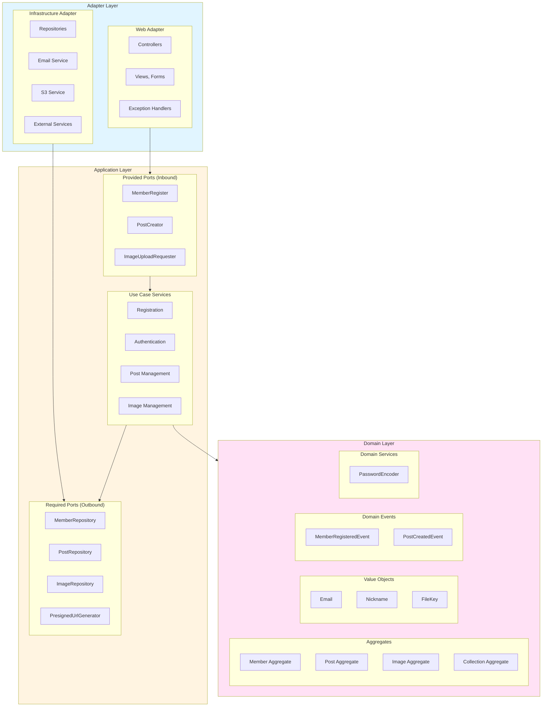
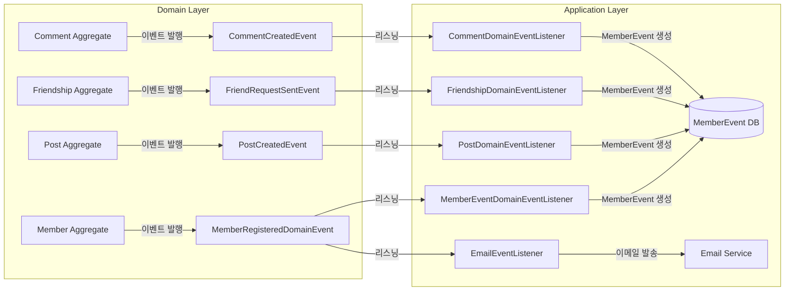
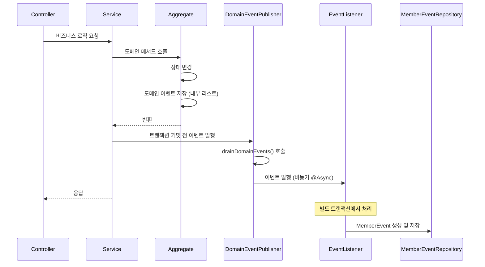

# RealMoneyRealTaste 아키텍처 문서

> 본 문서는 RealMoneyRealTaste 시스템의 아키텍처 설계와 도메인 모델링에 대해 설명합니다.

## 목차

- [1. 아키텍처 원칙](#1-아키텍처-원칙)
- [2. 레이어별 구현 예시](#2-레이어별-구현-예시)
- [3. 도메인 이벤트 시스템](#3-도메인-이벤트-시스템)
- [4. 프로젝트 구조](#4-프로젝트-구조)

---

## 1. 아키텍처 원칙

### 1.1 Clean Architecture + DDD (Domain-Driven Design)

RMRT는 **클린 아키텍처**와 **도메인 주도 설계**를 기반으로 구축되었습니다.

**핵심 원칙**

- **의존성 역전**: 고수준 모듈이 저수준 모듈에 의존하지 않음
- **관심사 분리**: 비즈니스 로직과 기술적 구현의 명확한 분리
- **테스트 가능성**: 모든 레이어의 독립적 테스트 지원
- **확장성**: 새로운 요구사항에 유연하게 대응

### 1.2 헥사고날 아키텍처 (Ports and Adapters)



**의존성 방향**: Adapter → Application → Domain (단방향)

---

## 2. 레이어별 구현 예시

### 2.1 Domain Layer (도메인 레이어)

**책임**: 핵심 비즈니스 로직과 규칙 구현

```kotlin
// 엔티티 예시 - Member
@Entity
class Member protected constructor(
    email: Email,
    nickname: Nickname,
    passwordHash: PasswordHash,
    // ...
) : BaseEntity() {

    fun activate() {
        if (status != MemberStatus.PENDING) {
            throw InvalidMemberStatusException.NotPending("등록 대기 상태에서만 등록 완료가 가능합니다")
        }
        status = MemberStatus.ACTIVE
        detail.activate()
        updatedAt = LocalDateTime.now()
    }

    companion object {
        fun register(email: Email, nickname: Nickname, password: PasswordHash): Member {
            return Member(
                email = email,
                nickname = nickname,
                passwordHash = password,
                detail = MemberDetail.register(),
                trustScore = TrustScore.create(),
                status = MemberStatus.PENDING,
                roles = Roles.ofUser(),
                updatedAt = LocalDateTime.now()
            )
        }
    }
}
```

**구성 요소**

- **Aggregates**: Member, Post, ActivationToken, PasswordResetToken
- **Value Objects**: Email, Nickname, PasswordHash, PostContent
- **Domain Services**: PasswordEncoder 인터페이스
- **Domain Events**: MemberRegisteredEvent, PostCreatedEvent

### 2.2 Application Layer (애플리케이션 레이어)

**책임**: 유스케이스 조율 및 트랜잭션 관리

```kotlin
@Service
@Transactional
class MemberRegistrationService(
    private val passwordEncoder: PasswordEncoder,
    private val memberRepository: MemberRepository,
    private val eventPublisher: ApplicationEventPublisher,
) : MemberRegister {

    override fun register(request: MemberRegisterRequest): Member {
        validateEmailNotDuplicated(request)
        val passwordHash = PasswordHash.of(request.password, passwordEncoder)
        val member = Member.register(request.email, request.nickname, passwordHash)
        val savedMember = memberRepository.save(member)
        publishMemberRegisteredEvent(savedMember)
        return savedMember
    }
}
```

**포트 (Ports)**

- **Provided Ports (인바운드)**: 외부에서 호출하는 인터페이스
    - `MemberRegister`, `PostCreator`, `MemberVerify`
- **Required Ports (아웃바운드)**: 외부 의존성 인터페이스
    - `MemberRepository`, `EmailSender`, `ActivationTokenGenerator`

### 2.3 Adapter Layer (어댑터 레이어)

**Web Adapter (인바운드 어댑터)**

```kotlin
@Controller
class MemberView(
    private val memberRegister: MemberRegister,
    private val memberVerify: MemberVerify,
) {

    @PostMapping("/signup")
    fun signup(@Valid form: SignupForm): String {
        val request = MemberRegisterRequest(form.email, form.nickname, form.password)
        memberRegister.register(request)
        return "redirect:/"
    }
}
```

**Infrastructure Adapter (아웃바운드 어댑터)**

```kotlin
@Repository
class JpaMemberRepository(
    private val jpaRepository: SpringDataMemberRepository
) : MemberRepository {

    override fun save(member: Member): Member = jpaRepository.save(member)
    override fun findByEmail(email: Email): Member? = jpaRepository.findByEmail(email.address)
    override fun findById(id: Long): Member? = jpaRepository.findById(id).orElse(null)
}
```

---

## 3. 도메인 이벤트 시스템

### 3.1 Event-Driven Architecture

RMRT는 **도메인 이벤트 기반 아키텍처**를 적용하여 도메인 간 결합도를 낮추고 확장성을 높였습니다.



### 3.2 AggregateRoot 패턴

#### 개념

도메인 엔티티가 상태 변경 시 도메인 이벤트를 발행하여 다른 도메인 로직을 트리거하는 패턴입니다.

```kotlin
fun interface AggregateRoot {
    /**
     * 애그리거트에 축적된 도메인 이벤트를 모두 가져오고 초기화합니다.
     */
    fun drainDomainEvents(): List<Any>
}
```

#### 구현 예시 - Member Aggregate

```kotlin
@Entity
class Member : BaseEntity(), AggregateRoot {
    private val domainEvents: MutableList<Any> = mutableListOf()

    fun activate() {
        if (status != MemberStatus.PENDING) {
            throw InvalidMemberStatusException.NotPending("등록 대기 상태에서만 등록 완료가 가능합니다")
        }
        status = MemberStatus.ACTIVE
        detail.activate()
        updatedAt = LocalDateTime.now()

        // 도메인 이벤트 발행
        domainEvents.add(
            MemberActivatedDomainEvent(
                memberId = requireId(),
                email = email.address,
                nickname = nickname.value,
                occurredOn = Instant.now()
            )
        )
    }

    override fun drainDomainEvents(): List<Any> {
        val events = domainEvents.toList()
        domainEvents.clear()
        return events
    }
}
```

### 3.3 도메인 이벤트 계층 구조

```kotlin
// 최상위 도메인 이벤트 인터페이스
interface DomainEvent {
    val occurredOn: Instant  // 이벤트 발생 시각
}

// 도메인별 마커 인터페이스
interface MemberDomainEvent : DomainEvent
interface PostDomainEvent : DomainEvent
interface CommentDomainEvent : DomainEvent
interface FriendDomainEvent : DomainEvent

// 구체적인 도메인 이벤트
data class MemberRegisteredDomainEvent(
    val memberId: Long,
    val email: String,
    val nickname: String,
    override val occurredOn: Instant
) : MemberDomainEvent

data class PostCreatedEvent(
    val postId: Long,
    val authorMemberId: Long,
    val restaurantName: String,
    val isSponsored: Boolean,
    override val occurredOn: Instant
) : PostDomainEvent
```

### 3.4 이벤트 발행 및 처리 흐름



#### 핵심 구현

**DomainEventPublisher (서비스)**

```kotlin
@Service
class DomainEventPublisherService(
    private val eventPublisher: ApplicationEventPublisher,
) : DomainEventPublisher {

    override fun publishDomainEvents(aggregateRoot: AggregateRoot) {
        aggregateRoot.drainDomainEvents().forEach { event ->
            eventPublisher.publishEvent(event)
        }
    }
}
```

**이벤트 리스너 (비동기 처리)**

```kotlin
@Component
class MemberEventDomainEventListener(
    private val memberEventCreator: MemberEventCreator,
    private val memberReader: MemberReader,
) {

    @Async
    @Transactional(propagation = Propagation.REQUIRES_NEW)
    @EventListener
    fun handleMemberRegistered(event: MemberRegisteredDomainEvent) {
        memberEventCreator.create(
            MemberEventCreateRequest(
                memberId = event.memberId,
                eventType = MemberEventType.ACCOUNT_ACTIVATED,
                title = "회원 가입 완료",
                message = "${event.nickname}님, 환영합니다!"
            )
        )
    }
}
```

### 3.5 이벤트 리스너 목록

#### MemberEventDomainEventListener

**처리하는 이벤트**

- `MemberRegisteredDomainEvent`: 회원 가입
- `MemberActivatedDomainEvent`: 계정 활성화
- `MemberDeactivatedDomainEvent`: 계정 비활성화
- `MemberProfileUpdatedDomainEvent`: 프로필 업데이트
- `PasswordChangedDomainEvent`: 비밀번호 변경

**수행 작업**: MemberEvent 엔티티 생성 (활동 기록)

#### EmailEventListener

**처리하는 이벤트**

- `EmailSendRequestedEvent`: 이메일 발송 요청

**수행 작업**: 이메일 발송 (회원가입 인증, 비밀번호 재설정)

#### FriendshipDomainEventListener

**처리하는 이벤트**

- `FriendRequestSentEvent`: 친구 요청 발송
- `FriendRequestAcceptedEvent`: 친구 요청 수락
- `FriendRequestRejectedEvent`: 친구 요청 거절
- `FriendshipTerminatedEvent`: 친구 관계 해제

**수행 작업**: 양방향 MemberEvent 생성 (발신자/수신자)

#### PostDomainEventListener

**처리하는 이벤트**

- `PostCreatedEvent`: 게시물 작성
- `PostDeletedEvent`: 게시물 삭제

**수행 작업**: MemberEvent 생성 (작성자)

#### CommentDomainEventListener

**처리하는 이벤트**

- `CommentCreatedEvent`: 댓글 작성
- `CommentDeletedEvent`: 댓글 삭제

**수행 작업**: MemberEvent 생성 (작성자 및 게시물 작성자)

### 3.6 이벤트 처리 특징

#### 비동기 처리 (@Async)

```kotlin
@Async
@Transactional(propagation = Propagation.REQUIRES_NEW)
@EventListener
fun handleEvent(event: DomainEvent) {
    // 이벤트 처리 로직
}
```

**장점**

- 메인 비즈니스 로직과 분리
- 실패 시 메인 로직에 영향 없음
- 성능 향상 (비동기 처리)

#### 트랜잭션 경계

```
1. 메인 트랜잭션: 도메인 엔티티 상태 변경
   ↓
2. 트랜잭션 커밋 전: 도메인 이벤트 발행
   ↓
3. 리스너 트랜잭션: 각 리스너가 독립 트랜잭션 (REQUIRES_NEW)
```

**Eventually Consistent 모델**

- 메인 로직은 즉시 일관성 유지
- 이벤트 처리는 최종 일관성 보장
- 시스템 전체의 복원력(resilience) 향상

---

## 4. 프로젝트 구조

```
src/main/kotlin/com/albert/realmoneyrealtaste/
├── adapter/                          # 어댑터 레이어
│   ├── webapi/                       # REST API 어댑터
│   │   ├── collection/               # 컬렉션 API
│   │   │   ├── CollectionCreateApi.kt
│   │   │   ├── CollectionReadApi.kt
│   │   │   ├── CollectionUpdateApi.kt
│   │   │   ├── CollectionDeleteApi.kt
│   │   │   └── request/
│   │   ├── friend/                   # 친구 API
│   │   │   └── FriendReadApi.kt
│   │   ├── follow/                   # 팔로우 API
│   │   │   └── FollowReadApi.kt
│   │   ├── comment/                  # 댓글 API
│   │   │   ├── CommentReadApi.kt
│   │   │   └── CommentWriteApi.kt
│   │   ├── image/                   # 이미지 API
│   │   │   ├── ImageApi.kt
│   │   │   └── ImageRestExceptionHandler.kt
│   │   └── exception/                # API 예외 처리
│   ├── webview/                      # WebView 어댑터 (MVC)
│   │   ├── auth/                     # 인증 뷰
│   │   │   ├── AuthView.kt
│   │   │   ├── AuthUrls.kt
│   │   │   ├── AuthViews.kt
│   │   │   ├── SignupForm.kt
│   │   │   └── SigninForm.kt
│   │   ├── member/                   # 회원 뷰 (리팩토링 완료)
│   │   │   ├── MemberAuthView.kt     # 인증 컨트롤러
│   │   │   ├── MemberProfileView.kt  # 프로필 컨트롤러
│   │   │   ├── MemberSettingsView.kt # 설정 컨트롤러
│   │   │   ├── MemberFragmentView.kt # 프래그먼트 컨트롤러
│   │   │   ├── MemberUrls.kt
│   │   │   ├── MemberViews.kt
│   │   │   ├── form/                 # 폼 클래스
│   │   │   ├── validator/            # 검증 로직
│   │   │   ├── converter/            # 데이터 변환
│   │   │   ├── util/                 # 유틸리티
│   │   │   └── message/              # 메시지 상수
│   │   ├── post/                     # 게시글 뷰
│   │   │   ├── PostView.kt
│   │   │   ├── PostUrls.kt
│   │   │   ├── PostViews.kt
│   │   │   └── forms/
│   │   ├── collection/               # 컬렉션 뷰
│   │   │   ├── CollectionReadView.kt
│   │   │   ├── CollectionUrls.kt
│   │   │   └── CollectionViews.kt
│   │   ├── friend/                   # 친구 뷰
│   │   │   ├── FriendReadView.kt
│   │   │   ├── FriendWriteView.kt
│   │   │   ├── FriendUrls.kt
│   │   │   └── FriendViews.kt
│   │   ├── follow/                   # 팔로우 뷰 (리팩토링 완료)
│   │   │   ├── FollowReadView.kt     # 조회 컨트롤러
│   │   │   ├── FollowCreateView.kt   # 생성 컨트롤러
│   │   │   ├── FollowTerminateView.kt # 삭제 컨트롤러
│   │   │   ├── FollowUrls.kt
│   │   │   └── fragments/            # 프래그먼트 분리
│   │   │       ├── followers.html    # 팔로워 목록
│   │   │       └── following.html    # 팔로잉 목록
│   │   └── comment/                  # 댓글 뷰
│   │       ├── CommentReadView.kt
│   │       ├── CommentWriteView.kt
│   │       ├── CommentUrls.kt
│   │       └── CommentViews.kt
│   ├── infrastructure/               # 인프라 어댑터
│   │   ├── s3/                       # AWS S3 어댑터
│   │   │   ├── S3Config.kt
│   │   │   └── S3PresignedUrlGenerator.kt
│   │   ├── email/                    # 이메일 어댑터
│   │   │   ├── EmailSenderImpl.kt
│   │   │   └── EmailTemplateService.kt
│   │   ├── security/                 # 보안 어댑터
│   │   │   ├── SecurityConfig.kt
│   │   │   ├── MemberPrincipal.kt
│   │   │   └── CustomAuthenticationProvider.kt
│   │   ├── persistence/              # 데이터베이스 어댑터
│   │   │   ├── member/
│   │   │   ├── post/
│   │   │   ├── image/
│   │   │   ├── collection/
│   │   │   ├── friend/
│   │   │   ├── follow/
│   │   │   └── comment/
│   └── configuration/                # 설정 클래스
├── application/                      # 애플리케이션 레이어
│   ├── member/                       # 회원 유스케이스
│   │   ├── service/                  # 애플리케이션 서비스
│   │   │   ├── MemberRegistrationService.kt
│   │   │   ├── MemberActivationService.kt
│   │   │   └── MemberUpdateService.kt
│   │   ├── dto/                      # 데이터 전송 객체
│   │   ├── event/                    # 도메인 이벤트
│   │   ├── provided/                 # 제공 포트 (인바운드)
│   │   │   ├── MemberRegister.kt
│   │   │   ├── MemberVerify.kt
│   │   │   └── MemberReader.kt
│   │   └── required/                 # 요구 포트 (아웃바운드)
│   │       ├── MemberRepository.kt
│   │       └── ActivationTokenRepository.kt
│   ├── post/                         # 게시글 유스케이스
│   │   ├── service/
│   │   │   ├── PostCreationService.kt
│   │   │   ├── PostReadService.kt
│   │   │   └── PostUpdateService.kt
│   │   ├── dto/
│   │   ├── provided/
│   │   │   ├── PostCreator.kt
│   │   │   ├── PostReader.kt
│   │   │   └── PostUpdater.kt
│   │   └── required/
│   │       └── PostRepository.kt
│   ├── collection/                   # 컬렉션 유스케이스
│   │   ├── service/
│   │   │   ├── CollectionCreationService.kt
│   │   │   ├── CollectionReadService.kt
│   │   │   ├── CollectionUpdateService.kt
│   │   │   └── CollectionDeleteService.kt
│   │   ├── dto/
│   │   │   ├── CollectionCreateRequest.kt
│   │   │   └── CollectionUpdateRequest.kt
│   │   ├── provided/
│   │   │   ├── CollectionCreator.kt
│   │   │   ├── CollectionReader.kt
│   │   │   ├── CollectionUpdater.kt
│   │   │   └── CollectionDeleter.kt
│   │   └── required/
│   │       └── CollectionRepository.kt
│   ├── friend/                       # 친구 유스케이스
│   │   ├── service/
│   │   │   ├── FriendRequestService.kt
│   │   │   ├── FriendResponseService.kt
│   │   │   ├── FriendshipReadService.kt
│   │   │   └── FriendshipTerminationService.kt
│   │   ├── dto/
│   │   ├── provided/
│   │   │   ├── FriendRequestor.kt
│   │   │   ├── FriendResponder.kt
│   │   │   ├── FriendshipReader.kt
│   │   │   └── FriendshipTerminator.kt
│   │   └── required/
│   │       └── FriendshipRepository.kt
│   ├── follow/                       # 팔로우 유스케이스
│   │   ├── service/
│   │   │   ├── FollowCreationService.kt
│   │   │   ├── FollowReadService.kt
│   │   │   └── FollowTerminationService.kt
│   │   ├── dto/
│   │   ├── provided/
│   │   │   ├── FollowCreator.kt
│   │   │   ├── FollowReader.kt
│   │   │   └── FollowTerminator.kt
│   │   └── required/
│   │       └── FollowRepository.kt
│   ├── comment/                      # 댓글 유스케이스
│   │   ├── service/
│   │   │   ├── CommentCreationService.kt
│   │   │   ├── CommentReadService.kt
│   │   │   └── CommentUpdateService.kt
│   │   ├── dto/
│   │   ├── provided/
│   │   │   ├── CommentCreator.kt
│   │   │   ├── CommentReader.kt
│   │   │   └── CommentUpdater.kt
│   │   └── required/
│   │       └── CommentRepository.kt
│   └── image/                        # 이미지 유스케이스
│       ├── service/
│       │   ├── ImageUploadService.kt
│       │   ├── ImageReadService.kt
│       │   └── ImageDeleteService.kt
│       ├── dto/
│       ├── provided/
│       │   ├── ImageUploadRequester.kt
│       │   ├── ImageReader.kt
│       │   └── ImageDeleter.kt
│       └── required/
│           ├── ImageRepository.kt
│           └── PresignedUrlGenerator.kt
└── domain/                           # 도메인 레이어
    ├── member/                       # 회원 도메인
    │   ├── Member.kt                 # 회원 애그리게이트 루트
    │   ├── MemberDetail.kt
    │   ├── TrustScore.kt
    │   ├── ActivationToken.kt
    │   ├── PasswordResetToken.kt
    │   ├── value/                    # 값 객체
    │   │   ├── Email.kt
    │   │   ├── Nickname.kt
    │   │   ├── PasswordHash.kt
    │   │   └── Roles.kt
    │   ├── service/                  # 도메인 서비스
    │   │   └── PasswordEncoder.kt
    │   └── exceptions/               # 도메인 예외
    │       ├── EmailValidationException.kt
    │       └── InvalidMemberStatusException.kt
    ├── post/                         # 게시글 도메인
    │   ├── Post.kt                   # 게시글 애그리게이트 루트
    │   ├── PostHeart.kt
    │   ├── value/                    # 값 객체
    │   │   ├── Author.kt
    │   │   ├── Restaurant.kt
    │   │   ├── PostContent.kt
    │   │   └── PostImages.kt
    │   └── exceptions/
    │       └── PostNotFoundException.kt
    ├── collection/                   # 컬렉션 도메인
    │   ├── PostCollection.kt         # 컬렉션 애그리게이트 루트
    │   ├── CollectionStatus.kt
    │   ├── CollectionPrivacy.kt
    │   ├── command/                  # 커맨드 객체
    │   │   ├── CollectionCreateCommand.kt
    │   │   └── CollectionUpdateCommand.kt
    │   ├── value/                    # 값 객체
    │   │   ├── CollectionInfo.kt
    │   │   ├── CollectionOwner.kt
    │   │   ├── CollectionPosts.kt
    │   │   └── CollectionFilter.kt
    │   └── exceptions/
    │       ├── CollectionNotFoundException.kt
    │       └── CollectionUpdateException.kt
    ├── friend/                       # 친구 도메인
    │   ├── Friendship.kt             # 친구 관계 애그리게이트 루트
    │   ├── FriendshipStatus.kt
    │   ├── command/
    │   │   └── FriendRequestCommand.kt
    │   ├── value/
    │   │   └── FriendRelationship.kt
    │   ├── event/                    # 도메인 이벤트
    │   │   ├── FriendRequestSentEvent.kt
    │   │   ├── FriendRequestAcceptedEvent.kt
    │   │   ├── FriendRequestRejectedEvent.kt
    │   │   └── FriendshipTerminatedEvent.kt
    │   └── exceptions/
    │       └── FriendApplicationException.kt
    ├── follow/                       # 팔로우 도메인
    │   ├── Follow.kt                 # 팔로우 애그리게이트 루트
    │   ├── FollowStatus.kt
    │   ├── command/
    │   │   └── FollowCreateCommand.kt
    │   ├── value/
    │   │   └── FollowRelationship.kt
    │   ├── event/
    │   │   ├── FollowStartedEvent.kt
    │   │   └── UnfollowedEvent.kt
    │   └── exceptions/
    │       └── FollowApplicationException.kt
    ├── comment/                      # 댓글 도메인
    │   ├── Comment.kt                # 댓글 애그리게이트 루트
    │   ├── CommentStatus.kt
    │   ├── value/
    │   │   ├── CommentContent.kt
    │   │   ├── CommentAuthor.kt
    │   │   └── CommentMention.kt
    │   ├── event/
    │   │   ├── CommentCreatedEvent.kt
    │   │   ├── CommentUpdatedEvent.kt
    │   │   └── CommentDeletedEvent.kt
    │   └── exceptions/
    │       └── CommentApplicationException.kt
    ├── image/                        # 이미지 도메인
    │   ├── Image.kt                  # 이미지 애그리게이트 루트
    │   ├── ImageType.kt
    │   ├── ImageStatus.kt
    │   ├── value/
    │   │   ├── FileKey.kt
    │   │   └── ImageMetadata.kt
    │   └── exceptions/
    │       └── ImageApplicationException.kt
    └── common/                       # 공통 도메인 요소
        ├── BaseEntity.kt
        └── exceptions/
            └── DomainException.kt
```
