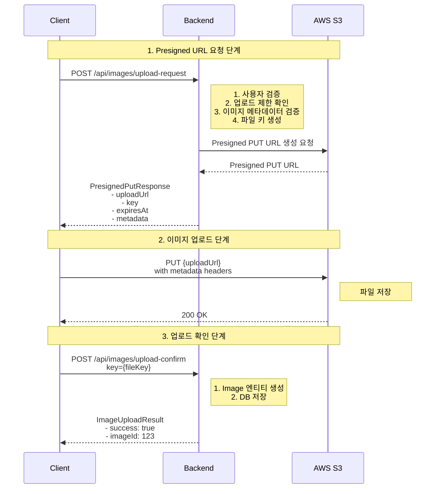
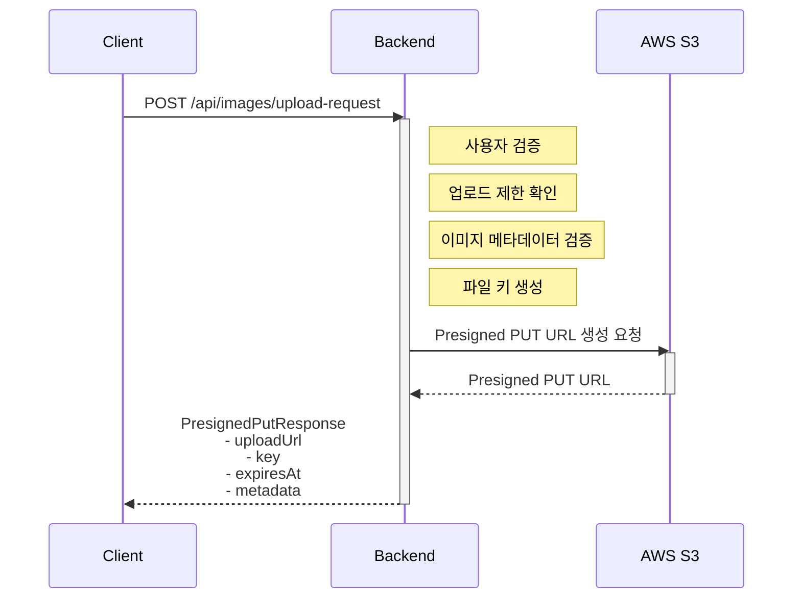
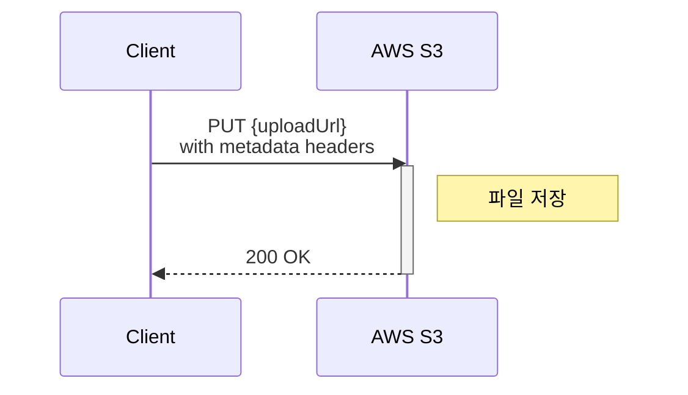
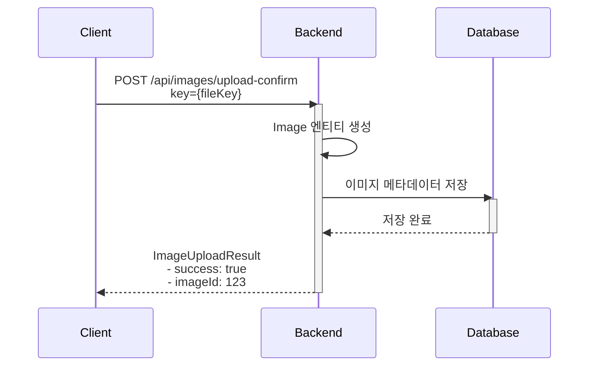

# 이미지 관리 시스템

## 개요

RMRT 이미지 관리 시스템은 AWS S3 기반의 안전하고 확장 가능한 이미지 업로드/조회/삭제 기능을 제공합니다. Presigned URL 방식을 사용하여 서버 부하를 최소화하고, 헥사고날 아키텍처를 통해 높은
유지보수성을 확보했습니다.

## 주요 기능

### 1. 이미지 업로드

- **AWS S3 Presigned PUT URL** 방식 사용
- 클라이언트가 S3에 직접 업로드하여 서버 부하 최소화
- 업로드 완료 후 데이터베이스에 메타데이터 저장
- 실시간 업로드 진행률 표시

### 2. 이미지 조회

- Presigned GET URL을 통한 안전한 이미지 접근
- 이미지 캐러셀 UI 지원
- 사용자별 이미지 목록 조회

### 3. 이미지 삭제

- 소프트 삭제 방식 (is_deleted 플래그)
- 사용자 권한 검증
- 게시글 연동 이미지 관리

## 아키텍처

### 헥사고날 아키텍처 적용

```
┌─────────────────────────────────────────────────────────────┐
│                        Adapter Layer                        │
│  ┌──────────────┐  ┌──────────────┐  ┌──────────────────┐   │
│  │  ImageApi    │  │  ImageView   │  │ S3PresignedUrl   │   │
│  │  (REST API)  │  │ (Thymeleaf)  │  │    Generator     │   │
│  └──────────────┘  └──────────────┘  └──────────────────┘   │
└─────────────────────────────────────────────────────────────┘
                            │
                            ▼
┌─────────────────────────────────────────────────────────────┐
│                     Application Layer                       │
│  ┌──────────────────────────────────────────────────────┐   │
│  │              Provided Ports (Inbound)                │   │
│  │  - ImageUploadRequester                              │   │
│  │  - ImageUploadTracker                                │   │
│  │  - ImageReader                                       │   │
│  │  - ImageDeleter                                      │   │
│  │  - ImageKeyGenerator                                 │   │
│  │  - ImageUploadValidator                              │   │
│  └──────────────────────────────────────────────────────┘   │
│                                                             │
│  ┌──────────────────────────────────────────────────────┐   │
│  │              Required Ports (Outbound)               │   │
│  │  - ImageRepository                                   │   │
│  │  - PresignedUrlGenerator                             │   │
│  └──────────────────────────────────────────────────────┘   │
└─────────────────────────────────────────────────────────────┘
                            │
                            ▼
┌─────────────────────────────────────────────────────────────┐
│                       Domain Layer                          │
│  ┌──────────────┐  ┌──────────────┐  ┌──────────────────┐   │
│  │    Image     │  │  ImageType   │  │     FileKey      │   │
│  │   (Entity)   │  │    (Enum)    │  │  (Value Object)  │   │
│  └──────────────┘  └──────────────┘  └──────────────────┘   │
└─────────────────────────────────────────────────────────────┘
```

### 레이어별 역할

#### Domain Layer

- `Image`: 이미지 도메인 엔티티 (업로드자, 이미지 타입, 삭제 여부 관리)
- `ImageType`: 이미지 타입 (PROFILE_IMAGE, POST_IMAGE, THUMBNAIL)
- `FileKey`: S3 파일 키 값 객체 (경로 안전성 검증)

#### Application Layer

**Provided Ports (애플리케이션이 제공하는 기능)**

- `ImageUploadRequester`: Presigned URL 요청
- `ImageUploadTracker`: 업로드 완료 추적 및 메타데이터 저장
- `ImageReader`: 이미지 조회 및 URL 생성
- `ImageDeleter`: 이미지 삭제
- `ImageKeyGenerator`: 안전한 파일 키 생성
- `ImageUploadValidator`: 업로드 요청 검증

**Required Ports (애플리케이션이 필요로 하는 기능)**

- `ImageRepository`: 이미지 영속성 관리
- `PresignedUrlGenerator`: AWS S3 Presigned URL 생성

#### Adapter Layer

- `ImageApi`: REST API 엔드포인트
- `ImageView`: Thymeleaf 뷰 모델
- `S3PresignedUrlGenerator`: AWS S3 연동 구현체

## 이미지 업로드 플로우

### 전체 플로우



### 1. Presigned URL 요청 단계



### 2. 이미지 업로드 단계



### 3. 업로드 확인 단계



## 데이터베이스 스키마

### images 테이블

```sql
CREATE TABLE images
(
    id          BIGINT AUTO_INCREMENT PRIMARY KEY,
    file_key    VARCHAR(512) NOT NULL UNIQUE COMMENT 'S3 파일 키',
    uploaded_by BIGINT       NOT NULL COMMENT '업로드한 사용자 ID',
    image_type  VARCHAR(20)  NOT NULL COMMENT '이미지 타입 (PROFILE_IMAGE, POST_IMAGE, THUMBNAIL)',
    is_deleted  BOOLEAN      NOT NULL DEFAULT FALSE COMMENT '삭제 여부',
    created_at  DATETIME(6)  NOT NULL COMMENT '생성 일시',
    updated_at  DATETIME(6)  NOT NULL COMMENT '수정 일시',

    INDEX idx_uploaded_by (uploaded_by),
    INDEX idx_image_type (image_type),
    FOREIGN KEY (uploaded_by) REFERENCES members (id)
) ENGINE = InnoDB
  DEFAULT CHARSET = utf8mb4
  COLLATE = utf8mb4_unicode_ci;
```

### 인덱스 전략

- `idx_uploaded_by`: 사용자별 이미지 조회 성능 최적화
- `idx_image_type`: 이미지 타입별 필터링 성능 최적화

## API 명세

### 1. Presigned URL 요청

**Endpoint**: `POST /api/images/upload-request`

**Request Body**:

```json
{
  "fileName": "photo.jpg",
  "contentType": "image/jpeg",
  "fileSize": 1024000,
  "imageType": "POST_IMAGE",
  "width": 1920,
  "height": 1080
}
```

**Response**:

```json
{
  "uploadUrl": "https://bucket.s3.region.amazonaws.com/path/to/file?X-Amz-...",
  "key": "posts/123/uuid-photo.jpg",
  "expiresAt": "2025-11-30T12:00:00Z",
  "metadata": {
    "original-name": "photo.jpg",
    "content-type": "image/jpeg",
    "file-size": "1024000",
    "width": "1920",
    "height": "1080"
  }
}
```

### 2. 업로드 확인

**Endpoint**: `POST /api/images/upload-confirm?key={fileKey}`

**Response**:

```json
{
  "success": true,
  "imageId": 123
}
```

### 3. 이미지 URL 조회

**Endpoint**: `GET /api/images/{imageId}/url`

**Response**:

```json
{
  "url": "https://bucket.s3.region.amazonaws.com/path/to/file?X-Amz-..."
}
```

### 4. 내 이미지 목록 조회

**Endpoint**: `GET /api/images/my-images`

**Response**:

```json
[
  {
    "imageId": 123,
    "fileKey": "posts/123/uuid-photo.jpg",
    "imageType": "POST_IMAGE",
    "createdAt": "2025-11-30T10:00:00Z"
  }
]
```

### 5. 이미지 삭제

**Endpoint**: `DELETE /api/images/{imageId}`

**Response**:

```json
{
  "message": "이미지가 성공적으로 삭제되었습니다"
}
```

## 보안 고려사항

### 1. 업로드 제한

- 일일 업로드 횟수 제한 (기본값: 100개)
- 파일 크기 제한 (최대 5MB)
- 지원 이미지 형식: JPEG, PNG, GIF, WebP

### 2. 파일 키 안전성

- UUID 기반 고유 파일명 생성
- 경로 탐색 공격 방지 (`..` 검증)
- 사용자별 디렉토리 분리

### 3. 접근 제어

- 인증된 사용자만 업로드 가능
- 업로드한 사용자만 삭제 가능
- Presigned URL 유효 시간 제한 (기본값: 15분)

### 4. 메타데이터 보안

- 민감정보 로깅 제거
- S3 메타데이터 헤더를 통한 파일 정보 전송
- CSRF 보호 적용

## 테스트 전략

### 1. 테스트 환경

- **Testcontainers + LocalStack**: 로컬 S3 환경 구축
- **CORS 설정**: 테스트 환경에서 클라이언트 업로드 지원
- **격리성**: 테스트별 독립적인 S3 버킷 사용

### 2. 테스트 커버리지

- 도메인 로직 테스트 (Image, FileKey, ImageType)
- 애플리케이션 서비스 테스트 (업로드, 조회, 삭제)
- API 통합 테스트 (MockMvc)
- S3 연동 테스트 (LocalStack)

### 3. 주요 테스트 케이스

```kotlin
// 도메인 테스트
-Image 생성 및 권한 검증
-FileKey 경로 안전성 검증
    -이미지 타입별 기능 테스트

// 애플리케이션 테스트
    -Presigned URL 생성
-업로드 완료 추적
-일일 업로드 제한 검증
    -이미지 삭제 권한 검증

// API 테스트
    -REST API 엔드포인트 테스트
    -예외 처리 테스트
-보안 검증 테스트
```

## 설정

### application-prod.yml

```yaml
aws:
  s3:
    access-key: ${AWS_ACCESS_KEY_ID}
    secret-key: ${AWS_SECRET_ACCESS_KEY}
    region: ${AWS_REGION:ap-northeast-2}
    bucket-name: ${S3_BUCKET_NAME}

image:
  upload:
    expiration-minutes: 15 # Presigned PUT URL 유효 시간
  get:
    expiration-minutes: 15 # Presigned GET URL 유효 시간
```

### 환경 변수

```bash
AWS_ACCESS_KEY_ID=your-access-key
AWS_SECRET_ACCESS_KEY=your-secret-key
AWS_REGION=ap-northeast-2
S3_BUCKET_NAME=your-bucket-name
```

## 프론트엔드 통합

### 이미지 업로드 컴포넌트 (Thymeleaf)

```html
<!-- image-upload.html 프래그먼트 -->
<div th:fragment="image-upload">
    <!-- 파일 선택 -->
    <input type="file" multiple accept="image/*"/>

    <!-- 업로드 진행률 -->
    <div class="progress">
        <div class="progress-bar" role="progressbar"></div>
    </div>

    <!-- 미리보기 -->
    <div class="preview-container"></div>
</div>
```

### 이미지 캐러셀 (Bootstrap)

```html
<!-- image-carousel.html 프래그먼트 -->
<div th:fragment="carousel" class="carousel slide">
    <div class="carousel-inner">
        <div
                th:each="imageUrl, iterStat : ${imageUrls}"
                th:classappend="${iterStat.first} ? 'active'"
                class="carousel-item"
        >
            
        </div>
    </div>

    <!-- 컨트롤 버튼 -->
    <button class="carousel-control-prev" type="button"></button>
    <button class="carousel-control-next" type="button"></button>
</div>
```

## 데이터베이스 마이그레이션

### Flyway 도입

- 버전 관리된 스키마 변경 추적
- CI/CD 파이프라인 통합
- 롤백 지원

### V1\_\_init.sql

```sql
-- 초기 스키마에 images 테이블 포함
-- 인덱스 및 외래키 제약조건 자동 생성
```

## 성능 최적화

### 1. 서버 부하 최소화

- 클라이언트가 S3에 직접 업로드
- 서버는 URL 생성과 메타데이터 관리만 담당

### 2. 데이터베이스 쿼리 최적화

- 인덱스 활용한 빠른 조회
- N+1 문제 방지 (findByIds 배치 조회)

### 3. CDN 활용 가능

- S3 Presigned GET URL을 CloudFront와 연동 가능
- 이미지 캐싱으로 응답 속도 개선

## 향후 개선 계획

### 1. 이미지 처리

- [ ] 썸네일 자동 생성 (Lambda)
- [ ] 이미지 리사이징
- [ ] WebP 자동 변환

### 2. 성능 개선

- [ ] CloudFront CDN 연동
- [ ] 이미지 캐싱 전략
- [ ] 레이지 로딩

### 3. 기능 확장

- [ ] 이미지 편집 기능
- [ ] 이미지 태깅
- [ ] 중복 이미지 감지

## 참고 자료

- [AWS S3 Presigned URL 가이드](https://docs.aws.amazon.com/AmazonS3/latest/userguide/PresignedUrlUploadObject.html)
- [Testcontainers LocalStack 모듈](https://www.testcontainers.org/modules/localstack/)
- [헥사고날 아키텍처](https://alistair.cockburn.us/hexagonal-architecture/)
- [Spring Boot S3 통합](https://docs.awspring.io/spring-cloud-aws/docs/current/reference/html/index.html)
